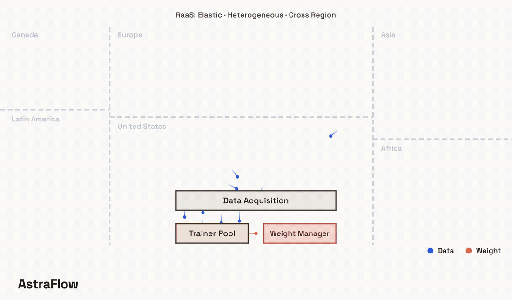
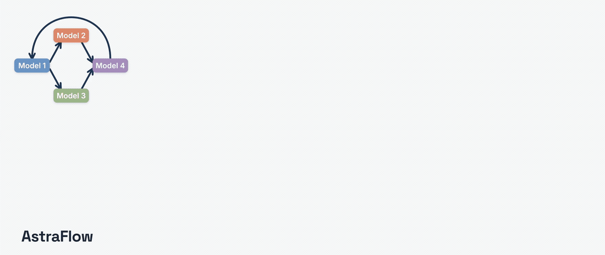

<div align="center" id="astraflowtop">
<h1>AstraFlow: Dataflow-Oriented Reinforcement Learning for Agentic LLMs</h1>

[](https://arxiv.org/abs/2605.15565)
[](https://haizhongzheng.github.io/astraflow/)
[](https://haizhongzheng.github.io/astraflow/docs/)
[](./LICENSE)

</div>

<!-- <p align="center">
<a href="https://arxiv.org/abs/2605.15565"><b>Paper</b></a> |
<a href="https://haizhongzheng.github.io/astraflow/"><b>Website</b></a> |
<a href="https://haizhongzheng.github.io/astraflow/docs/"><b>Documentation</b></a> |
<a href="./docs/en/recipes/"><b>Recipes</b></a> |
<a href="#citation"><b>Citation</b></a>
</p> -->

<div align="center">

</div>

<!-- <p align="center"><i>AstraFlow natively elastic, heterogeneous, and cross-region rollout with its RaaS (Rollout as a Service) abstraction</i></p> -->


**AstraFlow** is a **dataflow-oriented** reinforcement learning system designed to improve the flexibility and scalability of RL training for LLMs.

**AstraFlow** natively supports **multi-policy collaboration, elastic heterogeneous cross-region rollouts, and composable data algorithms** for LLM RL training.

**AstraFlow**’s clean rollout and trainer abstractions make both components fully **substitutable** with independent code base, allowing users to plug in custom rollout services or training backends as long as they implement the corresponding interfaces.


<div align="center">

</div>

<!-- <p align="center"><i>AstraFlow training a multi-policy workflow on an elastic, heterogeneous, cross-region rollout pool — all at once, with no feature-specific code.</i></p> -->

## News
- **[2026/05]** AstraFlow **v0.1.0** released — first public release of the full system.
- **[2026/05]** AstraFlow paper is on arXiv — [Dataflow-Oriented Reinforcement Learning for Agentic LLMs](https://arxiv.org/abs/2605.15565).

----

## Getting Started
The fastest path is the pre-built Docker image:

```bash
docker run --gpus all --net=host -it astraflowai/astraflow:v0.1.0
```

Then launch the 2-GPU Qwen3 math recipe from the repo root:

```bash
bash examples/math/qwen3-1.7b-m2po-2gpus-delta/scripts/run_qwen3-1.7b-m2po-2gpus-delta.sh
```

- [Install AstraFlow](docs/en/get-started/installation.md) — Docker image or install from source
- [Quick Start](docs/en/get-started/quickstart.md)
- [Architecture Overview](docs/en/architecture/overview.md)
- [Contribution Guide](docs/en/developer-guide/contributing.md)

## Recipes
Runnable recipes live under `examples/`. Each recipe ships a `yaml/` directory of configs and numbered launch scripts under `scripts/`. Most recipes default to one 8×H100 node; the `math/` folder also includes 2×H100 recipes for smaller setups.

| Recipe | Description | Docs |
|---|---|---|
| [`math/`](examples/math/) | RLVR math reasoning — Qwen3-1.7B / 8B, M2PO, full and delta-weight transfer | [math.md](docs/en/recipes/math.md) |
| [`math-multi-agent/`](examples/math-multi-agent/) | Actor + verifier collaborative math training | [multi-agent.md](docs/en/recipes/multi-agent.md) |
| [`math-efficient-data/`](examples/math-efficient-data/) | Composable data algorithms — GRESO, dynamic sampling, buffer replay | [math.md](docs/en/recipes/math.md) |
| [`code/`](examples/code/) | Code-generation RL — Qwen3-8B, M2PO | [code.md](docs/en/recipes/code.md) |
| [`code-multi-agent/`](examples/code-multi-agent/) | Codegen + verifier competitive coding | [code.md](docs/en/recipes/code.md) |
| [`search/`](examples/search/) | Search-augmented agent training with local retrieval | [search.md](docs/en/recipes/search.md) |
| [`alfworld/`](examples/alfworld/) | ALFWorld embodied household agent | [agentbench.md](docs/en/recipes/agentbench.md) |
| [`webshop/`](examples/webshop/) | WebShop web-navigation shopping agent | [agentbench.md](docs/en/recipes/agentbench.md) |

## Roadmap
Near-term focus:

- [ ] **Offline cluster training** — Support training on offline clusters without internet access.
- [ ] **All-in-one launcher** — A launcher helper that streamlines bringing up the AstraFlow, RaaS, and trainer services.
- [ ] **MoE model support** — Extend the training backends to Mixture-of-Experts models.
- [ ] **Terminal-Bench training** — Add a recipe for training agents on Terminal-Bench.
- [ ] **Megatron backend** — Add Megatron-LM as a training backend.
- [ ] **vLLM rollout engine** — Support vLLM alongside SGLang as a rollout engine.

## Citation
If you find AstraFlow useful in your research, please cite:

```bibtex
@article{zheng2026astraflow,
  title   = {AstraFlow: Dataflow-Oriented Reinforcement Learning for Agentic LLMs},
  author  = {Zheng, Haizhong and Di, Yizhuo and Wang, Jiahui and Jin, Shuowei and
             Liu, Xueshen and Wu, Yongji and Mao, Z. Morley and Stoica, Ion and
             Zhao, Jiawei and Chen, Beidi},
  journal = {arXiv preprint arXiv:2605.15565},
  year    = {2026}
}
```

## Acknowledgment
We learned the design and reused code from the following projects: [AReaL](https://github.com/areal-project/AReaL), [verl](https://github.com/verl-project/verl), [AgentBench](https://github.com/THUDM/AgentBench), [ASearcher](https://github.com/inclusionAI/ASearcher), and [M2PO](https://github.com/Infini-AI-Lab/M2PO).
