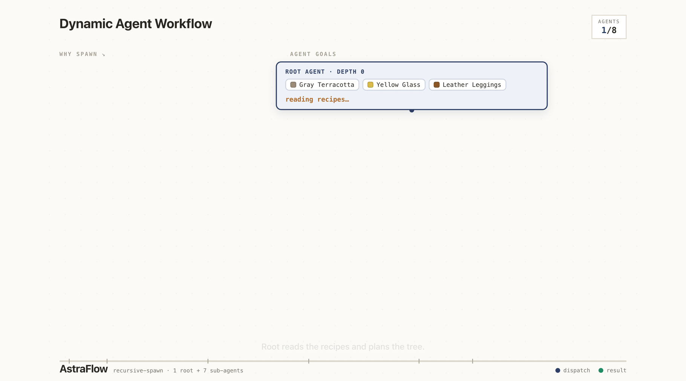
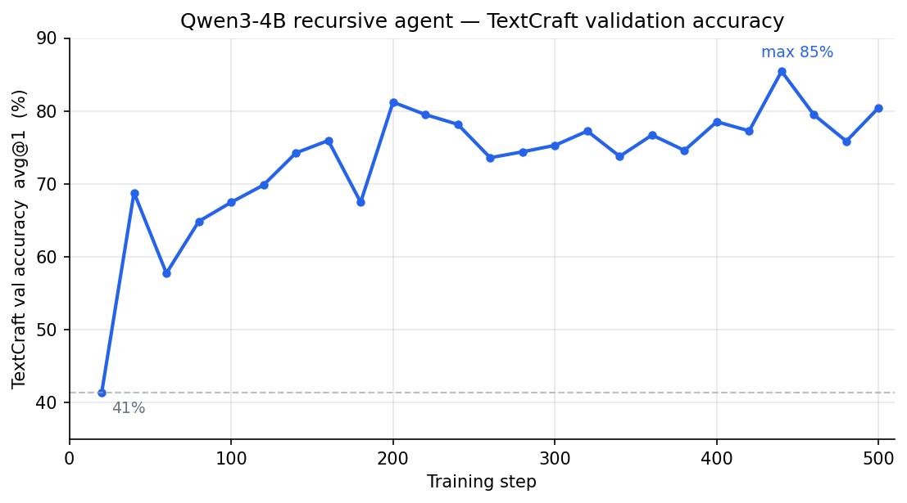

# TextCraft Recursive Agent — Qwen3-4B

A multi-turn **recursive-agent** RL recipe on TextCraft (a Minecraft-style
crafting environment), reproducing the design from
[*Recursive Agent Optimization*](https://arxiv.org/abs/2605.06639)
(Gandhi et al., 2026). Each turn the agent emits one action
(`craft` / `get_info` / `view_inventory` / `spawn` / `finish`), and it can
recursively **spawn up to 4 sub-agents in parallel** that share the parent's
inventory by reference. The tree of agents is flattened into one trajectory
sharing a single env-based team reward.

<p align="center">
  
</p>

Validation accuracy climbs from **~41%** to **~80%** over training:

<p align="center">
  
</p>

For more detailed info (design, how it works, and full settings), see the
[docs page](https://Infini-AI-Lab.github.io/astraflow/docs/en/recipes/textcraft-recursive.html).

## Run

Defaults to one 8-GPU node. TextCraft tasks are synthesized locally on first
launch — no network needed. Pre-fetch the model once:

```bash
huggingface-cli download Qwen/Qwen3-4B-Instruct-2507
```

All-in-one launcher:

```bash
bash examples/textcraft-recursive-agent/qwen3-4b-recursive/scripts/run_qwen3-4b-recursive.sh
```

Or launch the three components in separate terminals:

```bash
bash examples/textcraft-recursive-agent/qwen3-4b-recursive/scripts/1_astraflow.sh
bash examples/textcraft-recursive-agent/qwen3-4b-recursive/scripts/2_raas.sh
bash examples/textcraft-recursive-agent/qwen3-4b-recursive/scripts/3_trainer_model0.sh
```
